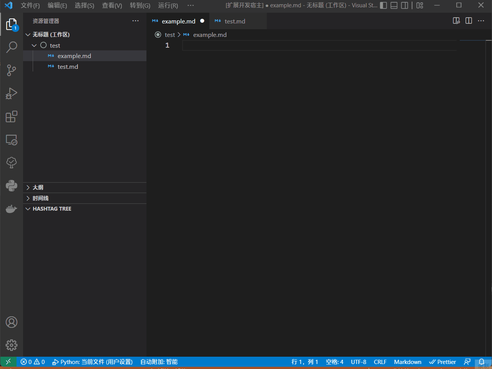
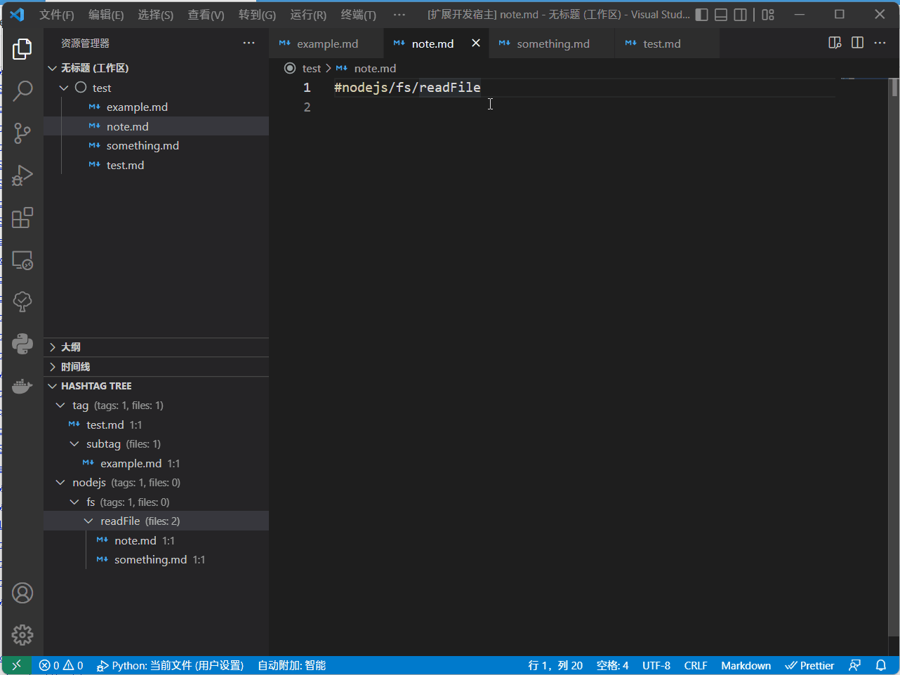
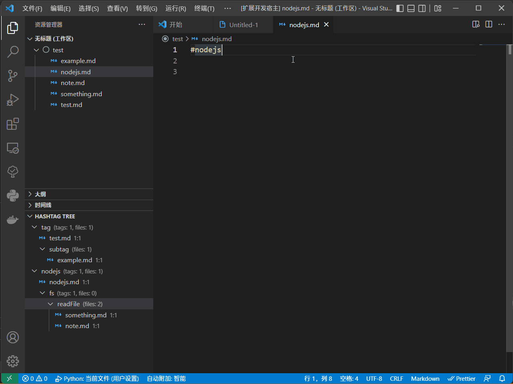
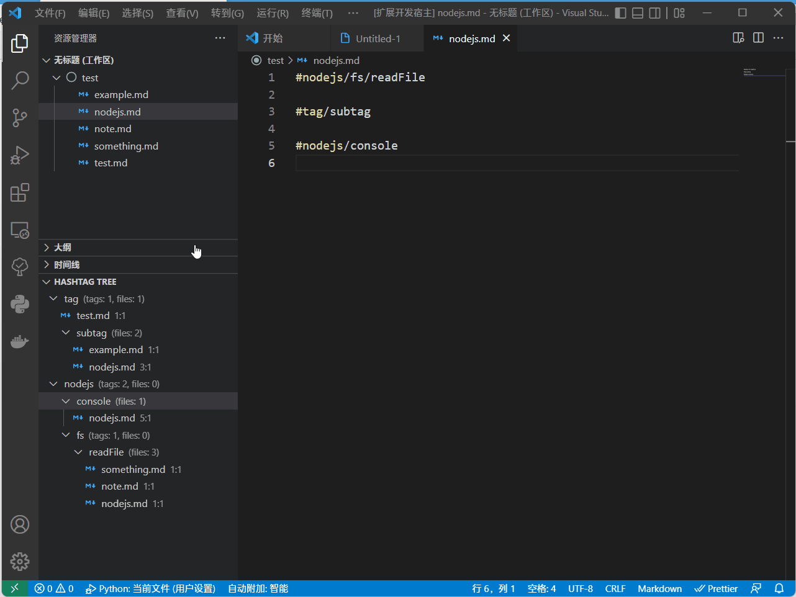
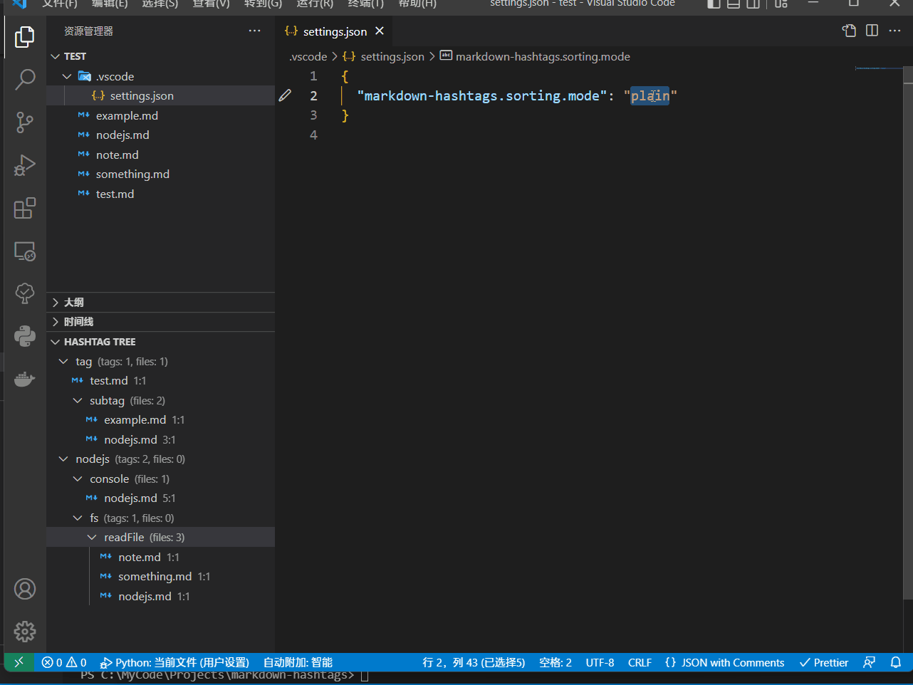

# Summary of the Update

## New features

- Now it can detect nested tags like `#tag/subtag`, also supports find-reference and autocompletion.

> Detecting rule: 
> - `#` is at the beginning of a line or after a whitespace character.
> - the hashtag path is cut off at a whitespace or a punctuation including `!@#$%^&*()=+.,[];:'"?><`.

> The autocompletion is triggered on both `#` and `/`:
> - [`#`]: Must be at the beginning of a line or after a whitespace character.
> - [`/`]: Must followed by a hashtags path, like `#tag/subtag/` will be triggered.







- The counter can count both tags and files. And it can be set to plain mode or deep mode. In deep mode, it will count all files in all depths of the hashtag.





- The user can customize detected file extensions in `settings.json`, see [New Settings](#new-settings).


## New Settings

```json
"markdown-hashtags.sorting.key": "name" // string type, can be set to "countFiles", "countTags", "name". default to "name".
"markdown-hashtags.sorting.mode": "plain"   // string type, can be set to "plain", "deep". default to "plain". 
"markdown-hashtags.file_extensions": [".md", ".markdown"]   // string[] type, the string must start with a dot(.). default to [".md"]
```

## Other Changes

- The refreshed time is changed from `onDidChangeTextDocument` to `onDidSaveTextDocument`, for performance reason.
- The refresh button will detect all files again.
- The tag tree will be refreshed when a file(files) is created, renamed, deleted.

## Fix

see the commit

## To-Do

- [ ] quick tag rename in tag tree
- [ ] quick file rename in tag tree
- [ ] tag move to another nested tag
- [ ] find-definition command (vscode) to locate specific tag in tag tree
- [ ] nested tags color
- [ ] *improve performance

---

---

# Hashtags in Markdown notes for VSCode

The extension provides, what is stands for: `#tag` functionality in markdown files. 😄
Inspiration comes from [Obsidian.md](https://obsidian.md/), [Markdown Notes](https://marketplace.visualstudio.com/items?itemName=kortina.vscode-markdown-notes) and [Nested Tags](https://marketplace.visualstudio.com/items?itemName=vscode-nested-tags.vscode-nested-tags).

How does this extensions differ from them?
- Markdown Notes provides same hashtag functionality, but also includes [[wiki-links]]. Markdown-hashtags only provides hashtags, so you can combine with different extension, like [Markdown Memo](https://marketplace.visualstudio.com/items?itemName=svsool.markdown-memo).
- Nested tags put hashtags in html comment and YAML front matter. Markdown-hashtags provides similar experience as hashtags in any social networks.

## Features

### Autocomplete


### Tree view


### Find all references


## Extension Settings

Currently no config provided.

## Known Issues

Extension can conflict with [Markdown Notes extension](https://marketplace.visualstudio.com/items?itemName=kortina.vscode-markdown-notes).

## Release Notes

See [Changelog](CHANGELOG.md).
