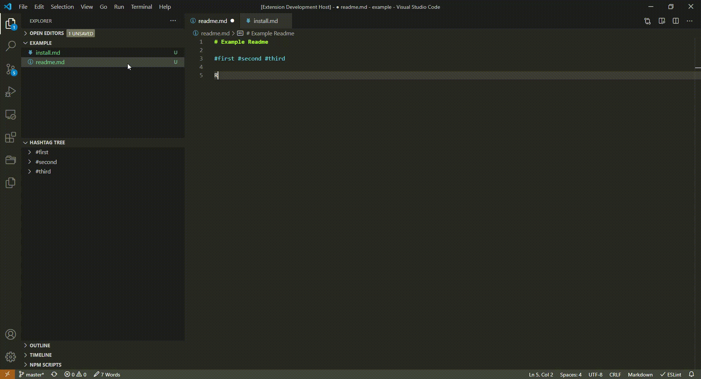
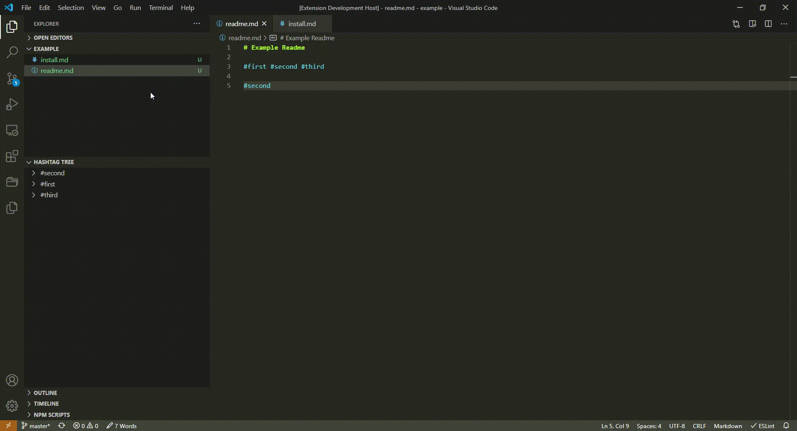

# Hashtags in Markdown notes for VSCode

The extension provides, what is stands for: `#tag` functionality in markdown files. 😄
Inspiration comes from [Obsidian.md](https://obsidian.md/), [Markdown Notes](https://marketplace.visualstudio.com/items?itemName=kortina.vscode-markdown-notes) and [Nested Tags](https://marketplace.visualstudio.com/items?itemName=vscode-nested-tags.vscode-nested-tags).

How does this extensions differ from them?
- Markdown Notes provides same hashtag functionality, but also includes [[wiki-links]]. Markdown-hashtags only provides hashtags, so you can combine with different extension, like [Markdown Memo](https://marketplace.visualstudio.com/items?itemName=svsool.markdown-memo).
- Nested tags put hashtags in html comment and YAML front matter. Markdown-hashtags provides similar experience as hashtags in any social networks.

## Features

### Autocomplete

### Tree view

### Find all references

## Extension Settings

Currently no config provided.

## Known Issues

Extension can conflict with [Markdown Notes extension](https://marketplace.visualstudio.com/items?itemName=kortina.vscode-markdown-notes).

## Release Notes

### 1.1.0

Add feature to support unicode hashtags (see [#5](https://github.com/vanadium23/markdown-hashtags/issues/5))
Fix a lot of grammar 😢

### 1.0.0

Initial release of `markdown-hashtags`
